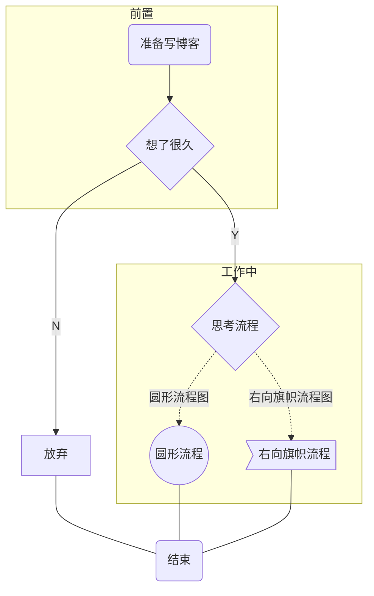
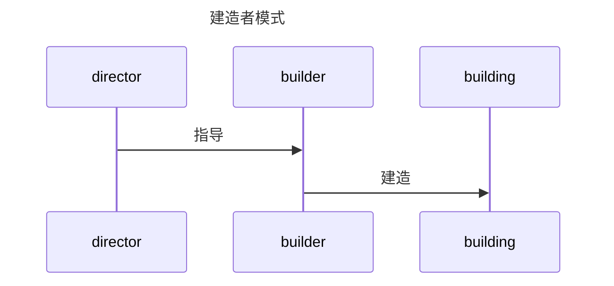
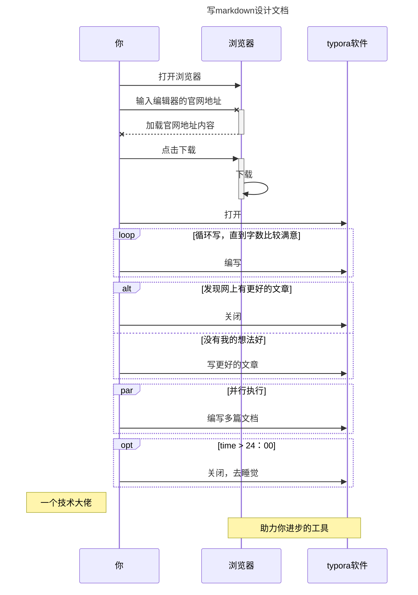
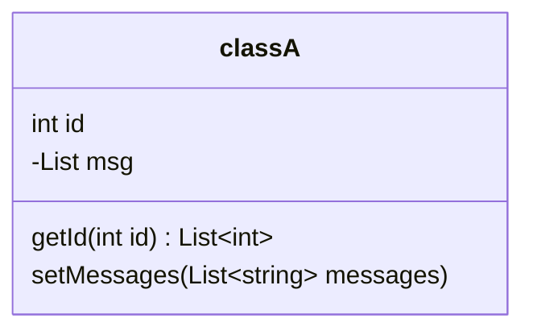
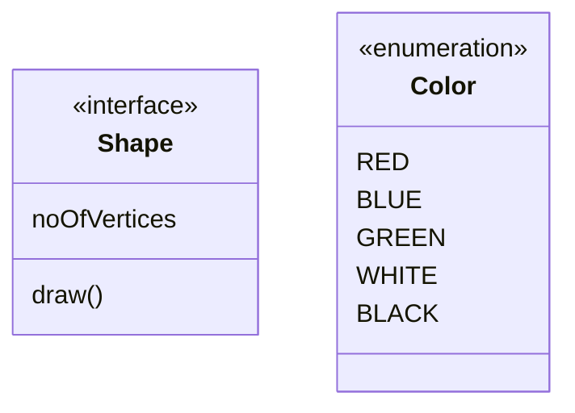
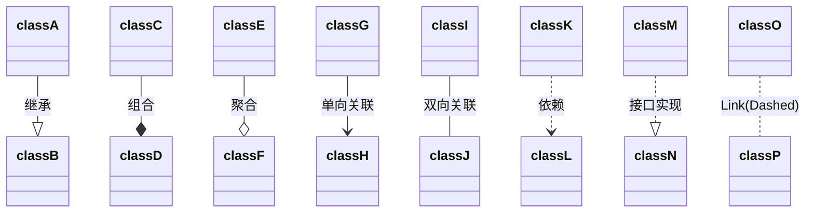
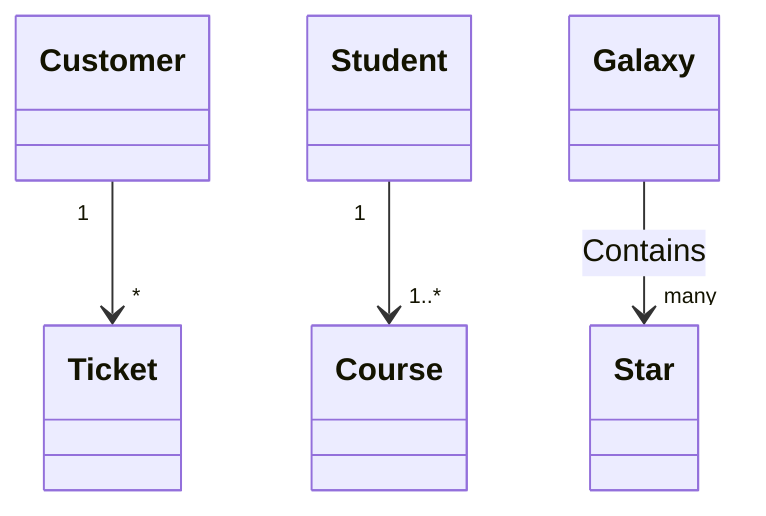

---

title: markdown画图
permalink: tool/text/markdown/flow/
tags:
  - mermaid
  - flow
categories:
  - markdown
date: 2022-06-03 18:46:58
---

doc https://mermaid.js.org/intro/

[**Live Editor!**](https://mermaid.live/)

## 流程图




<!--more-->


```flow
start=>start: 接收到消息
info=>operation: 读取信息
cd=>condition: 是否存在
setC=>subroutine: 设置缓存
getC=>operation: 读取缓存
xx=>inputoutput: 返回信息
end=>end: 处理结束

start->info->cd
cd(yes)->getC->xx
cd(no)->setC->xx
xx->end
```


>基本语法：定义模块 id=>关键字: 描述 （“描述”的前面必须有空格，“=>” 两端不能有空格）
>
>关键字：
>
>start 流程开始，以圆角矩形绘制
>
>operation 操作，以直角矩形绘制
>
>condition 判断，以菱形绘制
>
>subroutine 子流程，以左右带空白框的矩形绘制
>
>inputoutput 输入输出，以平行四边形绘制
>
>end 流程结束，以圆角矩形绘制
>
>定义模块间的流向：
>
>模块1 id->模块2 id ：
>
>一般的箭头指向条件模块id (描述)->模块id(direction) ：条件模块跳转到对应的执行模块，并指定对应分支的布局方向


## 泳道图








| 类型 | 描述                             |
| ---- | -------------------------------- |
| ->   | 无箭头的实线                     |
| –>   | 无箭头的虚线                     |
| ->>  | 有箭头的实线(主动发出消息)       |
| –>>  | 有箭头的虚线(响应)               |
| -x   | 末端为X的实线(主动发出异步消息)  |
| –x   | 有箭头的实线(以异步形式响应消息) |

>alt 可以理解为可替代的方案，可能的情况
>
>opt可以理解为一个if语句，满足条件下执行的操作


## UML类图














